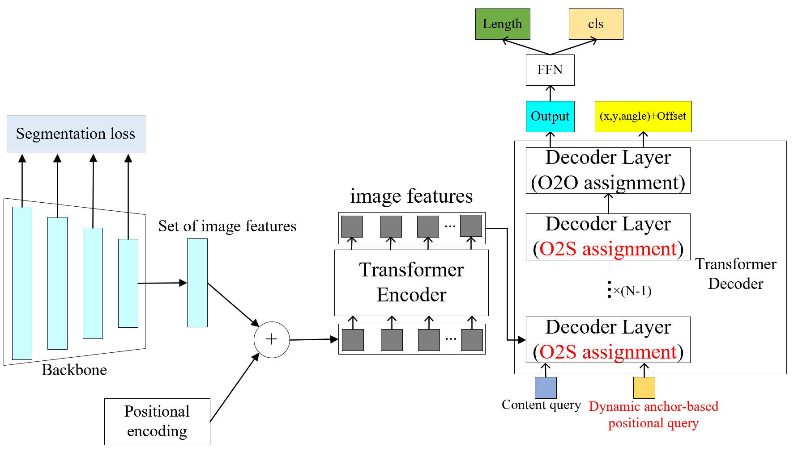

# O2SFormer
Pytorch implementation of our paper "End-to-End Lane detection with One to Several Transformer".

# News
[2023/4/17]: We release the code of O2SFormer, a SOTA lane detection method with DETR like architecture.

# Overview


## Model Zoo
### Results on CULane
<table>
  <thead>
    <tr style="text-align: right;">
      <th></th>
      <th>name</th>
      <th>backbone</th>
      <th>F1 score</th>
      <th>Checkpoint</th>
      <th>Where in <a href="https://arxiv.org/abs/2203.03605">Our Paper</a></th>
    </tr>
  </thead>
  <tbody>
    <tr>
      <th>1</th>
      <td>O2SFormer</td>
      <td>ResNet18</td>
      <td>76.07</td>
      <td><a href="https://github.com/zkyseu/O2SFormer/releases/download/weight/model_res18.pth">Weight</a></td>
      <td>Table 1</td>
    </tr>
    <tr>
      <th>2</th>
      <td>O2SForme</td>
      <td>ResNet34</td>
      <td>77.03</td>
      <td><a href="https://github.com/zkyseu/O2SFormer/releases/download/weight/model_res34.pth">Weight</a></td>
      <td>Table 1</td>
    </tr>
    <tr>
      <th>3</th>
      <td>O2SFormer</td>
      <td>ResNet50</td>
      <td>77.83</td>
      <td><a href="https://github.com/zkyseu/O2SFormer/releases/download/weight/model_res50.pth">Weight</a>&nbsp</td>
      <td>Table 1</td>
    </tr>
    <tr>
      <th>4</th>
      <td>O2SFormer*</td>
      <td>ResNet50</td>
      <td>78.00</td>
      <td><a href="https://github.com/zkyseu/O2SFormer/releases/download/weight/model_res50_hyb.pth">Weight</a>&nbsp</td>
      <td>Table 1</td>
    </tr>
  </tbody>
</table>
Note: * represents that we replace the encoder with HybridEncoder in RT-DETR, which aggregates multi-scale features.

## Installation
<details>
  <summary>Installation</summary>
  
  We construct the code of O2SFormer based on mmdetection. 
  We test our models under ```python=3.7.13,pytorch=1.12.1,cuda=10.2,mmdet=2.28.2,mmcv=1.7.1```. It should be noted that mmdet<=2.28.x.

   1. Clone this repo
   ```sh
   git clone https://github.com/zkyseu/O2SFormer.git
   cd O2SFormer
   ```

   2. Install Pytorch and torchvision

   Follow the instruction on https://pytorch.org/get-started/locally/.
   ```sh
   # an example:
   conda install -c pytorch pytorch torchvision
   ```

   3. Install other needed packages
   ```sh
   pip install -r requirements.txt
   # Note: If you meet errors when install mmdetection or mmcv, we suggset you can refer to mmdetection repo for more details
   ```

</details>

## Data

<details>
  <summary>1. CULane</summary>

 In our paper, we use CULane to evaluate the O2SFormer
  
Please download [CULane](https://xingangpan.github.io/projects/CULane.html) dataset. Unzip data to `$CULANEROOT` and then create `$data` directory
  
  
```Shell
cd $LANEDET_ROOT
mkdir -p data
ln -s $CULANEROOT data/CULane
```
  
Organize the CULane as following: 
```
$CULANEROOT/driver_xx_xxframe    # data folders x6
$CULANEROOT/laneseg_label_w16    # lane segmentation labels
$CULANEROOT/list                 # data lists
```

</details>

## Run

<details>
  <summary>1. Eval our pretrianed models</summary>

  <!-- ### Eval our pretrianed model -->
  Download our O2SFormer model checkpoint with ResNet50 and perform the command below. You can expect to get the F1 score about 77.83.
  ```sh
  bash eval.sh /path/to/your/checkpoint
  ```

</details>

<details>
  <summary>2. Train the model for 50 epochs</summary>

We use the O2SFormer trained for 50 epochs as an example to demonstrate how to train our model.

You can also train our model on a single process:
```sh
bash train.sh /path/config
```
  
You can run our model with multi-GPUs with following code:
```sh
bash dist_train.sh /path/config num_gpus
```

</details>

<details>
  <summary>3. Inference/Demo</summary>
We take the O2SFormer with ResNet34 as an example. You first download the weight of the model and then run the following code to get the visualization result. Result is saved in save.jpg.

```sh
 python infer_img.py configs/resnet_34_culane.py --checkpoint model_res34.pth --img_path /path/img
```


</details>

<details>
  <summary>4. Compute flops</summary>
We provide the script to reproduce the flops of our model. You can run the code below to compute the flops. We take the O2SFormer with ResNet18 as an example.

```sh
python get_macs.py configs/resnet_18_culane.py --shape 295 820
```

After running the code, you will get the results as followed.

```
==============================
Input shape: (3, 320, 832)
Flops: 15.21 GFLOPs
Params: 31.1 M
==============================
```


</details>

## Acknowledgement
* Our project is based on mmdetection and CLRNet. Thanks for their great work!
* We also thank the PaddleDetection for providing the code of HybridEncoder.
